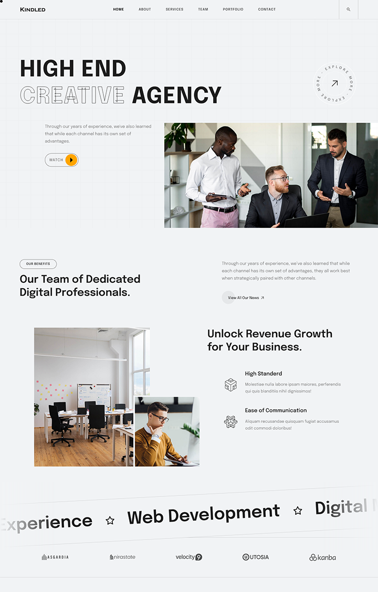

# Kindled

This is a website design made with the help of a design inspired by one of the [UI-ThemeZ](https://themeforest.net/user/ui-themez) [Geekfolio  theme's](https://themeforest.net/item/geekfolio-creative-agency-portfolio-template/45360728?gad_source=1&gclid=Cj0KCQjwtJKqBhCaARIsAN_yS_nxmpnUXGBLLzPp1V26CUXdx5KUtXprBkyjCrSe2TZ0LCMusuQbqxIaAqXzEALw_wcB) demo. This is done as part of my practice designing and developing websites and all the contents and images are copied from the demo. HTML, CSS and JavaScript codes of the website are done myself except for the content and images. This is only done for practice and not for any commercial use.

### Screenshot

### Links

- Solution URL: [Click here](https://github.com/shameerkamaludeen/kindled)
- Live Site URL: [Click here](https://shameerkamaludeen.github.io/kindled/)

### Built with

- Semantic HTML5 markup
- CSS
- Javascript
- Javascript modules
- Mobile-first workflow
- SCSS
- Bootstrap
- GSAP
- Animate.css
- Swiper
- Isotope
- Font Awesome
- Material icons
- Google Fonts

## Author

- Github - [Shameer Kamaludeen](https://github.com/shameerkamaludeen)

## Acknowledgments

Thanks to the Geekfolio where I picked the demo to design from.
